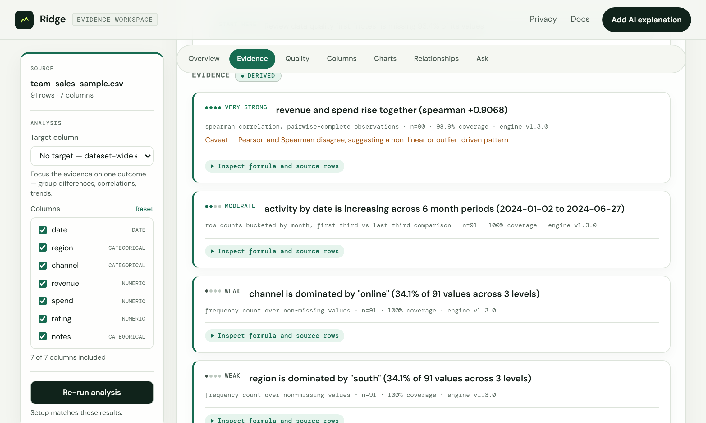
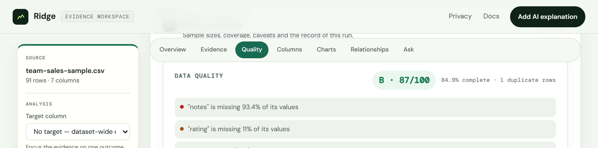

# Ridge

**Evidence-backed analysis for spreadsheets.**

[](https://github.com/MohammedAlkindi/Ridge/actions/workflows/ci.yml)
[](LICENSE)

Ridge turns spreadsheets and structured files into traceable findings, quality
diagnostics, statistical evidence, and clear explanations.

**Live: [ridge-data.vercel.app](https://ridge-data.vercel.app)** — drop a file
in and get results. No account, no API key.

## The problem

Most "AI for your spreadsheet" tools hand a language model a few rows and ask it
to be insightful. The model then invents statistics it cannot see, reports
correlations without saying how many observations they rest on, and treats blank
cells as zeroes — which quietly drags means toward zero and manufactures
relationships that are not in the data.

Ridge inverts the order. Everything numeric is computed deterministically
first — statistics, data quality, correlations, evidence — and that is the
product. A language model is offered afterwards, optionally, and its only job is
to explain evidence that already exists.

## Layout

| Route | What it is |
|---|---|
| `/` | Landing page — the problem, who it's for, how it works, what happens to your data |
| `/app` | The analysis workspace — upload, evidence, statistics, exports |
| `/privacy` | What is stored, and when |
| `/docs` | Using the app |

`/about` redirects to `/`. A share link of the form `/?a=<id>` forwards to
`/app?a=<id>`, so links created before the landing/workspace split still open.

## Screenshots

The workspace at `/app` after **Try sample data**: deterministic evidence,
statistics and quality diagnostics, with AI interpretation still un-run.

<!-- To refresh: npm run dev, open http://localhost:3000, click "Try sample
     data", and capture the dashboard into docs/images/. -->

| Evidence and statistics | Data quality |
|---|---|
|  |  |

## Supported files

| Kind | Extensions |
|---|---|
| Spreadsheets | `.xlsx` `.xls` `.csv` |
| Structured | `.json` |
| Text | `.txt` `.md` |
| Documents | `.pdf` `.docx` `.doc` `.pptx` `.ppt` |

Up to 10 files, **4 MB total per request** (a Vercel body limit, enforced on
both the client and the server). Larger files — to 25 MB — go through the URL
box, which fetches server-side.

## What works without an API key

Everything below is computed on the server. No model is involved and nothing is
sent to Anthropic.

- **Structural reading** — where the header actually starts, and which rows
  restate other rows instead of being observations. A title block above the
  header and a `TOTAL` row at the bottom are excluded before anything is
  computed, and every excluded row is reported with the reason. When the file
  does not settle the question, Ridge says so rather than guessing, and you can
  correct the header row or put a row back. A sheet whose shape reads as
  transposed — field names down the first column, records across the columns —
  is declared uncertain instead of being averaged in silence.
- **Column statistics** — valid/missing/invalid counts, coverage, min, max,
  mean with a 95% t interval, median, standard deviation, quantiles, and IQR
  outlier fences.
- **Categorical profiles** — top values ranked by *frequency* with counts and
  percentages, unique counts, and whether a field reads as an identifier, a
  category, or high-cardinality text.
- **Date profiles** — valid/invalid counts, range, bucketed trend,
  period-over-period change, gaps, and irregular intervals.
- **Correlations** — Pearson and Spearman over pairwise-complete observations,
  each reported with method, `n`, coverage, strength and caveats — and each
  drawn: the paired observations travel with the coefficient as a scatter (or
  a density grid for large pairings), with an at-a-glance matrix over every
  numeric column pair.
- **Charts for every column** — a histogram, frequency or trend chart for each
  column with a computed full-file aggregate, numeric spread strips
  (five-number summaries with IQR fences), per-column completeness tracks, and
  one-click PNG export of any chart.
- **Inference and change detection** — Welch mean intervals, chi-square with
  Cramér's V, two-sample KS distribution shifts, and exploratory robust level
  shifts over dated targets.
- **Data quality** — a weighted health grade with per-column issues,
  missingness, type consistency and duplicate detection.
- **Evidence Mode** — see below.
- **Exports** — JSON, a printable HTML report, and any chart as a PNG.
- **Comparison mode** — baseline/current schema drift, quality movement,
  descriptive deltas, mean intervals, and distribution shifts for two files.

## Optional AI

Add your own Anthropic key (⚙ in the top bar) to unlock:

- **Explain with Claude** — an interpretation of the evidence already computed.
- **Follow-up questions** — ask about the dataset in plain language.
- **Cross-file synthesis** — themes and differences across a multi-file upload.
- **Document reading** — PDFs, Word and PowerPoint get real analysis rather
  than an extracted-text preview.

Models: Claude Sonnet 5 (default, balanced), Claude Opus 5 (most capable),
Claude Haiku 4.5 (fastest). The key is used per request and never stored
server-side — see [PRIVACY.md](PRIVACY.md).

## Evidence Mode

Every material finding is a structured object rather than a sentence:

```json
{
  "claim": "revenue and spend rise together (spearman +0.9068)",
  "metric": "spearman_rho",
  "value": 0.9068,
  "columns": ["revenue", "spend"],
  "method": "spearman correlation, pairwise-complete observations",
  "sampleSize": 90,
  "coverage": 98.9,
  "strength": "very strong",
  "caveat": "Pearson and Spearman disagree, suggesting a non-linear or outlier-driven pattern",
  "statistics": null,
  "engineVersion": "1.1.0",
  "provenance": {
    "formula": "ρ = Pearson correlation of the paired value ranks",
    "includedRows": 90,
    "excludedRows": 1,
    "sourceRows": [{ "rowNumber": 1, "values": { "revenue": 100, "spend": 45 } }]
  }
}
```

Pick an optional **target column** and the engine focuses on that outcome:
group comparisons across categories with a standardized effect size and Welch
interval, categorical associations with Cramér's V,
correlations involving the target, missingness impact, and trends over time.

The AI layer may summarize and contextualize these objects and must carry their
caveats forward. It cannot add numbers they do not contain. Deterministic
results and AI interpretation are labelled distinctly everywhere they appear,
including in the exported report.

## Privacy and persistence

- Files are processed **in memory** and nothing is retained after the response.
- **Nothing is stored server-side unless you opt in** per analysis with *"Save
  this analysis to history and enable a share link"*, which is off by default.
  A configured database is capability, not consent.
- Saved analyses can be deleted from the history list.
- Your API key lives in **session storage by default** (cleared with the tab),
  or local storage only if you tick *Remember this key on this device*. It is
  sent with each AI request to this backend, which forwards it to Anthropic. It
  is never stored server-side or written to logs.

Full detail: [PRIVACY.md](PRIVACY.md) and the live `/privacy` page.

## Run a five-user pilot

Use [docs/PILOT_PLAYBOOK.md](docs/PILOT_PLAYBOOK.md) to recruit and observe five
people with recurring finance, operations, or analytics spreadsheet work. It
defines the session protocol, privacy boundary, return-use metric, and decision
thresholds. Non-confidential product feedback can be submitted through the
repository's **Pilot feedback** issue form.

## Quick start

```bash
git clone https://github.com/MohammedAlkindi/Ridge && cd Ridge
npm ci
npm run dev            # http://localhost:3000
```

Click **Try sample data** — no configuration needed.

## Environment variables

All optional; the app runs with none of them set.

| Variable | Purpose |
|---|---|
| `ANTHROPIC_API_KEY` | Server-side fallback key. Leave unset for pure BYOK. |
| `SUPABASE_URL` / `SUPABASE_KEY` | Enables opt-in history and share links. Unset disables the feature cleanly. |
| `PORT` | Local port, default `3000`. |
| `RATE_LIMIT_POINTS` | Analyze requests per minute per IP, default `10`. |
| `RATE_LIMIT_ASK_POINTS` | Follow-up and explain requests per minute per IP, default `20`. |

Copy `.env.example` to `.env` to set them locally.

## Architecture

```
public/            static app (/, /about, /privacy, /docs) + sample data
src/routes/        analyze · ask · explain · history · health
src/services/      anthropic · remoteFile · history          (all I/O)
src/analytics/     values · stats · dates · correlations ·
                   evidence · sample · profile               (pure)
src/parsers/       spreadsheet · document · structured
api/index.js       Vercel serverless entry
```

Routes validate and orchestrate; services own every external call; analytics and
parsers are pure and unit-tested. Errors become `AppError` and reach the client
only as `{ error, code, requestId }`. Details in [docs/ARCHITECTURE.md](docs/ARCHITECTURE.md);
endpoint reference in [docs/API.md](docs/API.md).

## Tests

```bash
npm test              # unit + API integration (vitest) — no network, no key
npm run test:browser  # Playwright journeys, desktop + mobile
npm run test:all      # both
```

The suite mocks the Anthropic SDK; it never needs a real key and never makes a
provider call.

## Deployment

Deployed on Vercel as static `public/` plus one serverless function
(`api/index.js`). `vercel.json` disables framework detection, enables
`cleanUrls`, redirects `/about` → `/`, and forwards `/?a=<id>` to `/app` so
share links from the previous layout keep working.

```bash
vercel --prod
```

Set `ANTHROPIC_API_KEY`, `SUPABASE_URL` and `SUPABASE_KEY` in the Vercel project
only if you want a server fallback key and history.

Ridge also ships a non-root, health-checked OCI image for private deployments:

```bash
docker build -t ridge:local .
docker run --rm -p 3000:3000 ridge:local
```

Data-flow modes, scaling limits and the production checklist are documented in
[docs/DEPLOYMENT.md](docs/DEPLOYMENT.md).

## Releases

Semantic versioning. Every release has a matching `package.json` version, a
`CHANGELOG.md` entry, an annotated `vX.Y.Z` tag, a GitHub Release, green checks
and a verified production deployment. Process:
[docs/RELEASING.md](docs/RELEASING.md).

## Contributing

See [CONTRIBUTING.md](CONTRIBUTING.md). Security policy: [SECURITY.md](SECURITY.md).
Roadmap: [ROADMAP.md](ROADMAP.md).

## License

MIT — see [LICENSE](LICENSE).
